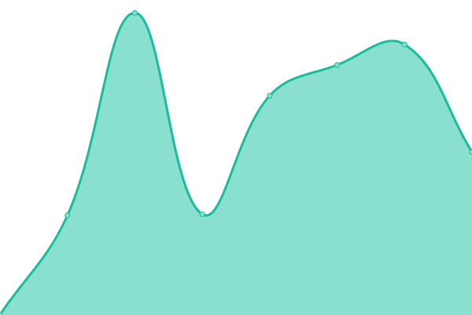
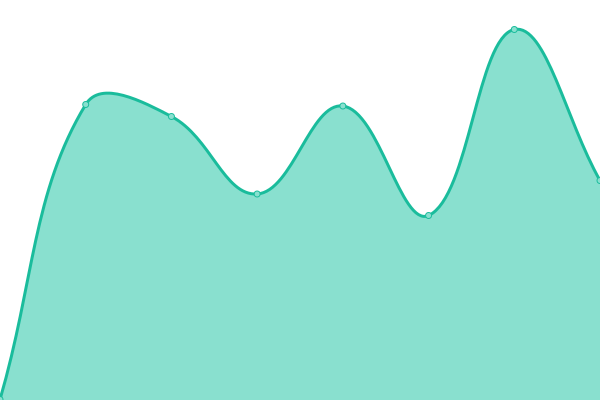

# [📈 Live Status](https://EddieHubCommunity.github.io/monitoring): <!--live status--> **🟧 Partial outage**

This repository contains the open-source uptime monitor and status page for [EddieHub](http://eddiehub.org), powered by [Upptime](https://github.com/upptime/upptime).

With [Upptime](https://upptime.js.org), you can get your own unlimited and free uptime monitor and status page, powered entirely by a GitHub repository. We use [Issues](https://github.com/EddieHubCommunity/monitoring/issues) as incident reports, [Actions](https://github.com/EddieHubCommunity/monitoring/actions) as uptime monitors, and [Pages](https://EddieHubCommunity.github.io/monitoring) for the status page.

<!--start: status pages-->
<!-- This summary is generated by Upptime (https://github.com/upptime/upptime) -->
<!-- Do not edit this manually, your changes will be overwritten -->
<!-- prettier-ignore -->
| URL | Status | History | Response Time | Uptime |
| --- | ------ | ------- | ------------- | ------ |
|  [BioDrop (biodrop.io)](http://biodrop.io) | 🟩 Up | [bio-drop-biodrop-io.yml](https://github.com/EddieHubCommunity/monitoring/commits/HEAD/history/bio-drop-biodrop-io.yml) | 

 637ms
     
 | 

<a href="https://EddieHubCommunity.github.io/monitoring/history/bio-drop-biodrop-io">100.00%</a>
    

|  [LinkFree (linkfree.io)](http://linkfree.io) | 🟩 Up | [link-free-linkfree-io.yml](https://github.com/EddieHubCommunity/monitoring/commits/HEAD/history/link-free-linkfree-io.yml) | 

 408ms
     
 | 

<a href="https://EddieHubCommunity.github.io/monitoring/history/link-free-linkfree-io">100.00%</a>
    

|  [LinkFree (linkfree.eddiehub.io)](http://linkfree.eddiehub.io) | 🟩 Up | [link-free-linkfree-eddiehub-io.yml](https://github.com/EddieHubCommunity/monitoring/commits/HEAD/history/link-free-linkfree-eddiehub-io.yml) | 

 421ms
     
 | 

<a href="https://EddieHubCommunity.github.io/monitoring/history/link-free-linkfree-eddiehub-io">100.00%</a>
    

|  [Finder](http://finder.eddiehub.io) | 🟥 Down | [finder.yml](https://github.com/EddieHubCommunity/monitoring/commits/HEAD/history/finder.yml) | 

 673ms
     
 | 

<a href="https://EddieHubCommunity.github.io/monitoring/history/finder">99.99%</a>
    

|  [API](http://api.eddiehub.org) | 🟩 Up | [api.yml](https://github.com/EddieHubCommunity/monitoring/commits/HEAD/history/api.yml) | 

 1238ms
     
 | 

<a href="https://EddieHubCommunity.github.io/monitoring/history/api">100.00%</a>
    

|  [RepoRater](https://repo-rater.eddiehub.io) | 🟩 Up | [repo-rater.yml](https://github.com/EddieHubCommunity/monitoring/commits/HEAD/history/repo-rater.yml) | 

 168ms
     
 | 

<a href="https://EddieHubCommunity.github.io/monitoring/history/repo-rater">100.00%</a>
    

<!--end: status pages-->

[**Visit our status website →**](https://EddieHubCommunity.github.io/monitoring)

## 📄 License

- Powered by: [Upptime](https://github.com/upptime/upptime)
- Code: [MIT](./LICENSE) © [EddieHub](http://eddiehub.org)
- Data in the `./history` directory: [Open Database License](https://opendatacommons.org/licenses/odbl/1-0/)

## Our Pledge

We take participation in our community as a harassment-free experience for everyone and we pledge to act in ways to contribute to an open, welcoming, diverse and inclusive community.

If you have experienced or been made aware of unacceptable behaviour, please remember that you can report this. Read our [Code of Conduct](https://github.com/EddieHubCommunity/monitoring/blob/master/CODE_OF_CONDUCT.md).
